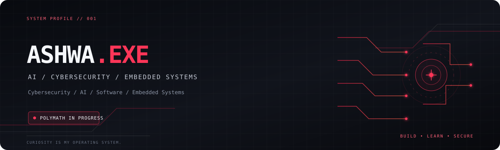

  

# 👋 Hey, I'm Ashwa Karthik

### 🧠 Polymath in Progress | Engineer | Cybersecurity Enthusiast | AI Explorer

> Exploring the intersection of technology, engineering,
> intelligence, and innovation.

I'm a multidisciplinary technology enthusiast passionate
about understanding how things work, building practical
solutions, and exploring ideas across different fields.

My interests span cybersecurity, artificial intelligence,
software development, electronics, robotics, networking,
and experimental engineering.

I believe the most interesting innovations happen when
different disciplines come together.

## 🧭 My Seven Domains

🛡️ Cybersecurity & Ethical Hacking
🤖 Artificial Intelligence & Automation
💻 Software Development & Programming
⚙️ Electronics & Embedded Systems
🔬 Robotics & Intelligent Automation
🌐 Networking & Linux Systems
🚀 Innovation, Research & Experimentation

## 🛠️ Technologies I Explore

- Languages: Python, C, C++
- Systems: Linux, Kali Linux
- Security: Reconnaissance, security assessment
- AI: AI tools, assistant development, automation
- Electronics: Arduino, ESP32, sensors
- Automation: Python scripting, APIs, n8n

## 🚀 Selected Projects

### 🔎 ASHWA CYBERRECON
A modular Python-based cybersecurity reconnaissance framework.

### 🤖 AI Assistant
Exploring locally run AI models and assistant automation.

### 📧 Email Threat Scanner
An email threat-analysis workflow built using n8n.

## 🧠 My Philosophy

Learn across disciplines.
Build through experimentation.
Connect ideas.
Solve meaningful problems.

## 🎯 Current Mission

To become a multidisciplinary engineer who combines
cybersecurity, AI, and engineering to build useful,
innovative, and secure technologies.

---

*"Curiosity across disciplines. Innovation without boundaries."*

### 🤝 Let's Connect

- 💼 LinkedIn: www.linkedin.com/in/karthik-ashwa-82bbab425 
- 💻 GitHub: [@ashwakarthik](https://github.com/ashwakarthik)

---

*"Building skills. Breaking assumptions. Securing systems."* 🔐## Hi there 👋
